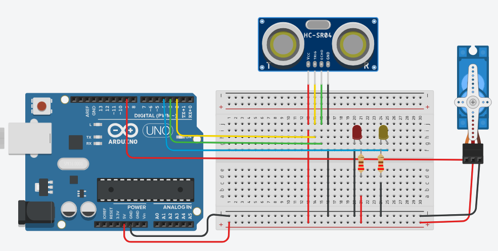
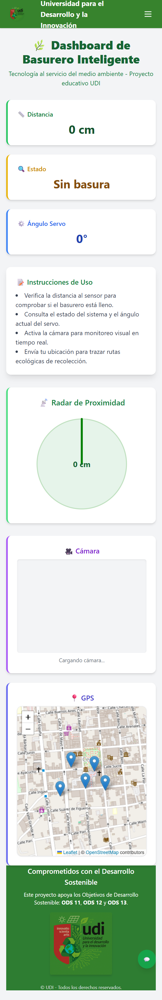

# ♻️ Sistema de Monitoreo de Residuos Inteligente - UDI

Este proyecto tiene como objetivo ayudar al monitoreo de residuos utilizando tecnologías como **Flask**, **Python**, y **comunicación serial** con dispositivos externos (por ejemplo, sensores de basura inteligente).

---

## 🖥️ Capturas y Demostración

### 🎥 Video demostrativo


### 🖼️ Captura de pantalla





---

## ⚙️ Tecnologías utilizadas

- Python 3.x
- Flask
- PySerial
- HTML + TailwindCSS
- Comunicación Serial (Arduino u otros microcontroladores)

---

## 📦 Instalación

### 🔧 Clonar el repositorio

```bash
git clone https://github.com/tu_usuario/tu_proyecto.git
cd tu_proyecto

python3 -m venv venv
source venv/bin/activate

python -m venv venv
venv\Scripts\activate

pip install flask pyserial
pip install -r requirements.txt
pip freeze > requirements.txt
python app.py


