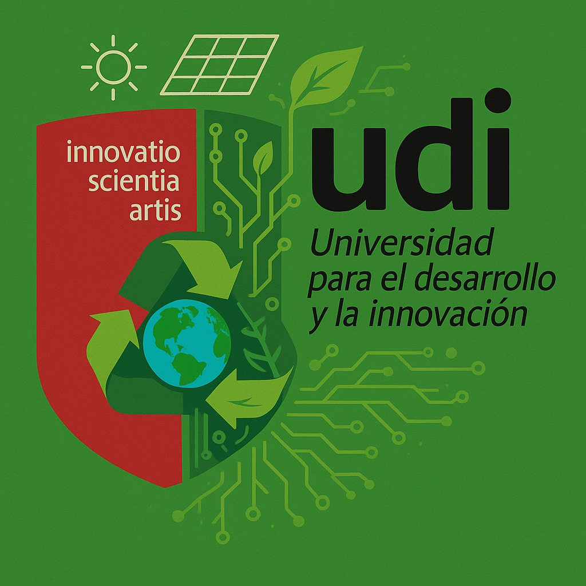
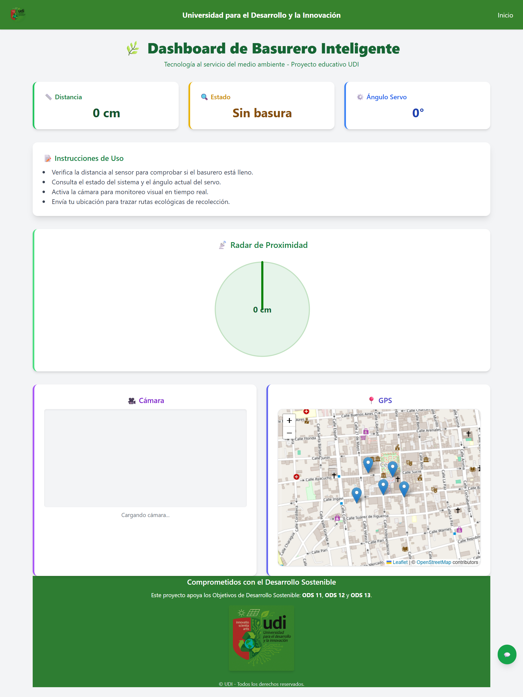
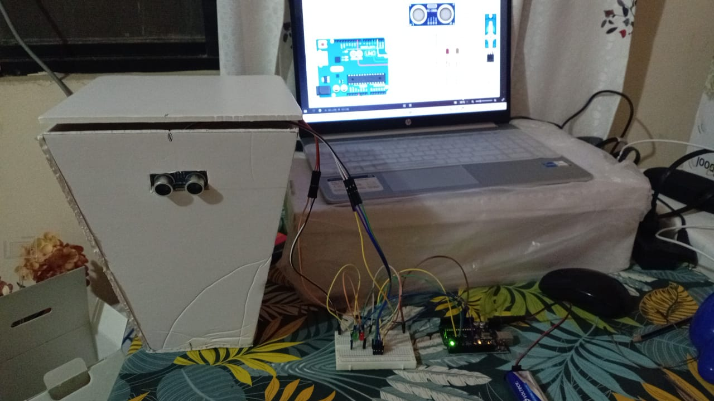

# ♻️ Sistema de Monitoreo de Residuos Inteligente - UDI



Proyecto de código abierto que integra **Arduino**, **Python** y **Flask** para monitorear niveles de residuos en tiempo real, promoviendo prácticas sostenibles y contribuyendo a los Objetivos de Desarrollo Sostenible (ODS) 11, 12 y 13.

---

## 🚀 Características

- 📡 Monitoreo en tiempo real de niveles de residuos mediante sensores ultrasónicos.
- 🌐 Interfaz web responsiva desarrollada con Flask y TailwindCSS.
- 🔌 Comunicación serial eficiente entre Arduino y Python usando PySerial.
- 📊 Visualización clara y concisa de datos para facilitar la toma de decisiones.

---

## 🖥️ Capturas y Demostración

### 🎥 Video Demostrativo

[](static/video/prototipo.mp4)

### 🖼️ Capturas de Pantalla

| Interfaz Web | Prototipo Físico |
|--------------|------------------|
|  |  |

---

## 🧰 Tecnologías Utilizadas

- **Hardware**: Arduino UNO/Nano, sensores ultrasónicos HC-SR04.
- **Backend**: Python 3.x, Flask, PySerial.
- **Frontend**: HTML5, TailwindCSS, JavaScript.
- **Comunicación**: Serial (USB).

---

## ⚙️ Instalación y Ejecución

### 1. Clonar el Repositorio

```bash
git clone https://github.com/Pericena/basureo.git
cd basureo

- En Linux/macOS:
python3 -m venv venv
source venv/bin/activate

- En Windows:
python -m venv venv
venv\Scripts\activate

pip install flask pyserial
pip install -r requirements.txt
pip freeze > requirements.txt
python app.py

- http://localhost:5000/.
```

### Estructura del Proyecto
.
├── app.py
├── templates/
│   └── index.html
├── static/
│   ├── logo.png
│   ├── prototipo.jpeg
│   ├── diseño.png
│   └── screencapture/
│       ├── screencapture-web.png
│       └── screencapture-movil.png
├── requirements.txt
└── README.md


### Contribuciones
¡Las contribuciones son bienvenidas! Si deseas mejorar este proyecto, por favor sigue los siguientes pasos:

Haz un fork del repositorio.

Crea una nueva rama (git checkout -b feature/nueva-funcionalidad).

Realiza tus cambios y haz commits descriptivos.

Envía un pull request detallando tus modificaciones.

### Licencia
Este proyecto está licenciado bajo la Licencia MIT.

###  Autores
- Fernando Daniel
- Luishiño Pericena Choque
(UDI)
Contribuyendo a los ODS: 11, 12 y 13 🌍


### 2. 📁 Estructura del Repositorio

Organiza tu repositorio para mejorar la claridad y facilitar la navegación:

- `arduino/`: Código fuente para Arduino.
- `static/`: Archivos estáticos como imágenes, CSS y JavaScript.
- `templates/`: Plantillas HTML para Flask.
- `docs/`: Documentación adicional, si es necesaria.

### 3. 📝 Archivo de Licencia

Incluye un archivo `LICENSE` en la raíz del proyecto. La [Licencia MIT](https://choosealicense.com/licenses/mit/) es una opción popular para proyectos de código abierto.

### 4. 📄 Archivo `.gitignore`

Asegúrate de tener un archivo `.gitignore` adecuado para Python y entornos virtuales. Puedes generar uno en [gitignore.io](https://www.toptal.com/developers/gitignore).

### 5. 🧪 Pruebas y Validaciones

Considera agregar pruebas unitarias para asegurar la funcionalidad del proyecto y facilitar futuras contribuciones.

### 6. 📸 Recursos Multimedia

Asegúrate de que las imágenes y videos estén optimizados para la web. Puedes utilizar herramientas como [TinyPNG](https://tinypng.com/) para comprimir imágenes sin perder calidad.

---

Si deseas, puedo ayudarte a implementar estas mejoras directamente en tu repositorio o guiarte paso a paso en el proceso. ¿Te gustaría proceder con alguna de estas sugerencias?
::contentReference[oaicite:0]{index=0}
 
